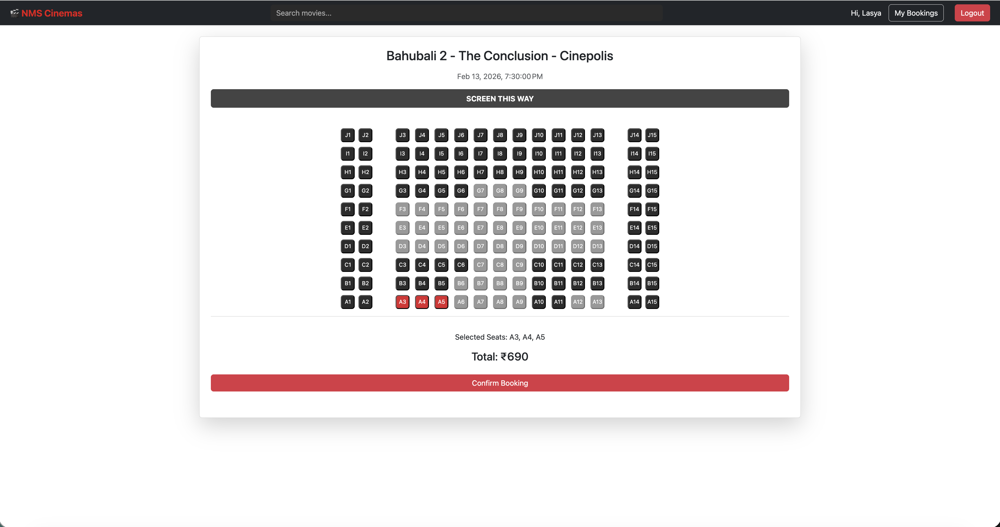

# 🎬 Movie Booking Application

A full-stack Movie Ticket Booking platform with role-based access for Admin and Users.  
The application allows administrators to manage movies and show schedules, while users can browse listings, book tickets, and cancel reservations through a seamless workflow.

---

## 🚀 Features

### 👤 User Side
- Browse available movies and show timings
- Select seats and book tickets
- Cancel booked tickets
- Clean and intuitive booking flow

### 🛠 Admin Side
- Add, update, and delete movies (CRUD operations)
- Manage show timings and availability
- View booking records

---

## 🏗 Architecture Overview

Frontend (Angular)  
⬇  
REST APIs (Spring Boot)  
⬇  
MySQL Database  
⬇  
Deployed on AWS EC2 (Dockerized)

---

## 🧰 Tech Stack

### Frontend
- Angular
- HTML5 / CSS3
- TypeScript

### Backend
- Java
- Spring Boot
- RESTful APIs
- Maven

### Database
- MySQL

### DevOps / Deployment
- Docker
- AWS EC2
- Jenkins (CI/CD exposure)

---

## 📸 Application Screenshots

### 🏠 Home Page


### 🎟 Booking Flow


### 🛠 Admin Dashboard


> Add your screenshots inside a folder named `screenshots/` in the root directory.

---

## ⚙️ Setup Instructions

### 🔹 Backend Setup

```bash
cd backend
mvn clean install
mvn spring-boot:run

Backend runs on:  http://localhost:8080

Make sure MySQL is running and database credentials are configured properly in application.properties.

**🔹 Frontend Setup**
cd frontend
npm install
ng serve

Frontend runs on:  http://localhost:4200


**🌐 Deployment**

The application can be deployed on AWS EC2 using Docker.

Example Docker commands:

docker build -t movie-booking-app .
docker run -p 8080:8080 movie-booking-app


🔐 Role-Based Access

Admin credentials manage movie data

Users interact only with booking interface

Backend enforces API-level access control


**🧠 Key Learning Outcomes**

Designed and implemented RESTful APIs

Built full-stack integration between Angular and Spring Boot

Implemented role-based system logic

Deployed containerized application on AWS EC2

Worked with CI/CD workflows


**🚀 Future Enhancements**

Payment gateway integration

JWT authentication

Seat availability locking mechanism

Email confirmation service

Production-ready deployment pipeline


